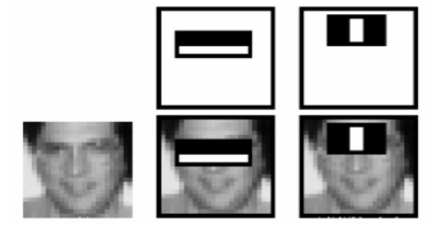
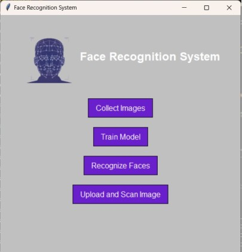

# Face Recognizer using Harr Cascade

### **Table of content**
- [Description](#description) 
- [Documentation](#documentation)
- [Features](#features)
    - [Face Detection](#face-detection)
    - [Data Gathering](#data-gathering) 
    - [Model Training and Face Recognition](#model-training-and-face-recognition)
    - [User Interface](#user-interface)
- [Contributors](#contributors) 

## Description

Face Recognition is a technology that enables the identification or verification of individuals based on their facial features. It has gained significant attention due to its applications in security, surveillance, access control, and personal device authentication. This technology involves various processes, from capturing an image of a face to comparing it against a database of known faces.

Our project aims to develop a comprehensive face recognition system that can collect images using a camera interface, train a recognition model, and accurately identify faces. The key components of our project are:

## Documentation

- **[Project Report](./Resources/AI_LAB_Project_Report.pdf)**

## Features

### Face Detection

- In order to capture a face we decided to use the *Haar Cascade classifier* for our project since it's one of the most common use classifiers. 
- Emphasis is placed on **key facial features such as the eyes and nose**, as the darkness of the eye region compared to the more light nose and cheeks region.

  

### Data Gathering

- The images for training were gathered in two ways: by **capturing photos** via a webcam and **uploading existing files**.
- For captured photos, the system takes **30 frames** from the webcam (set to a resolution of 640×480).

### Model Training and Face Recognition

- For model trainging **LBPH (Local Binary Patterns Histograms Stogra)** Face Recognizer is used.
- For face recognition, the laptops camera is used to make the *prediction*.

### User Interface

- Implemented the GUI using the Tkinter library.
- Employed threading from the Python threading module to manage concurrent tasks within the system.

  

## Contributors

- [Favia Abazi](https://github.com/faviaabazi) 
- [Giulia Imbrea](https://github.com/giuliastf)
- [Goidan Matei](https://github.com/MateiGoidan)
- [Udrea Ionut](https://github.com/Rix313379)

